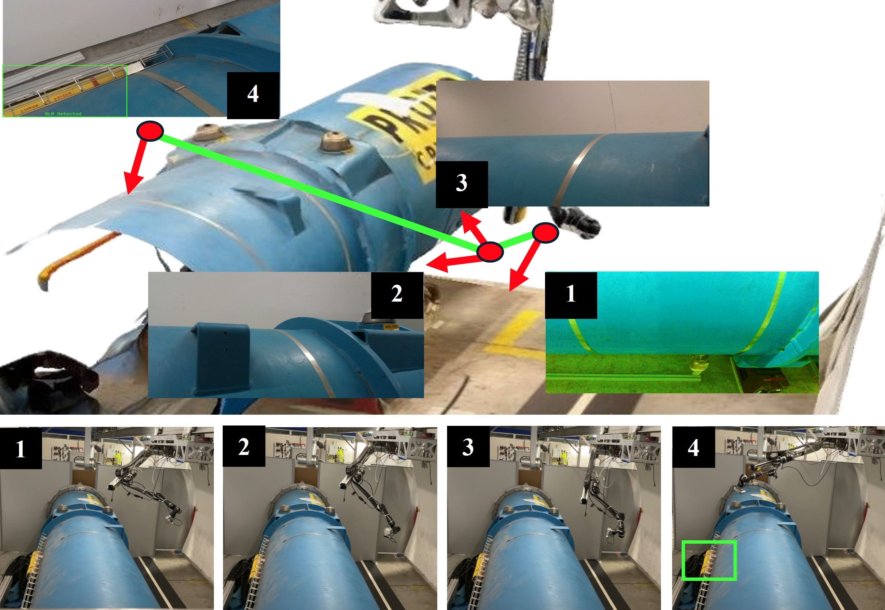
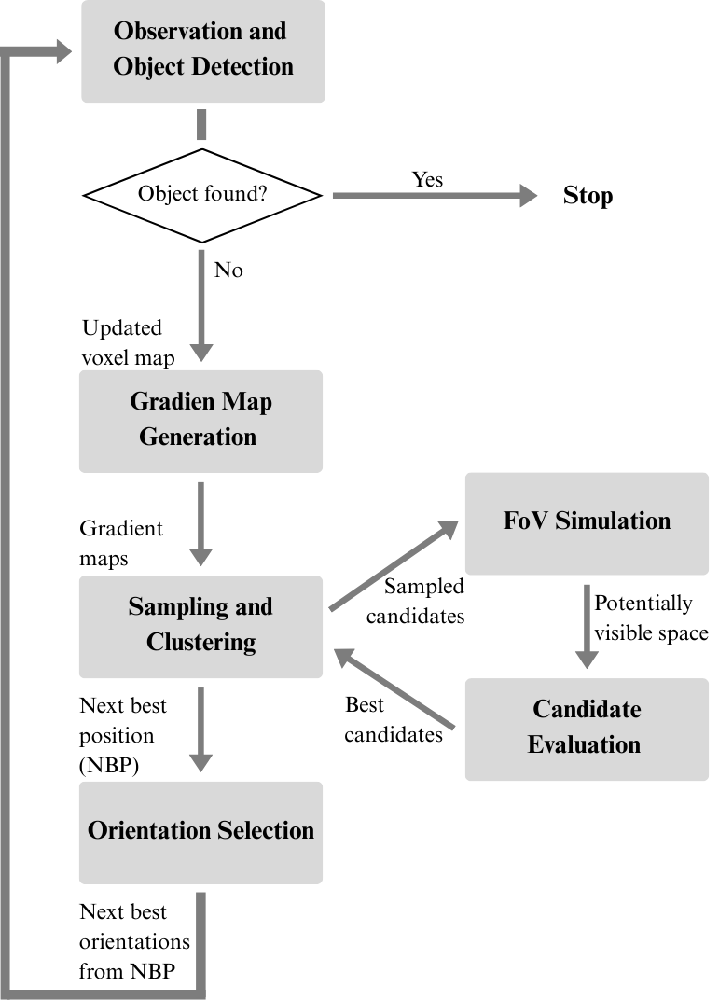

## Disclaimer

This repository contains research code that was developed as part of a Master’s thesis project. The primary goal of releasing this code is to support transparency and reproducibility of the results presented in the associated research work.

While the implementation reflects the methods used in the research, it should be considered research-grade software rather than production-ready code. As such, it may lack the robustness, documentation, testing, and long-term maintenance typically required for deployment in production environments.

The code is shared with the robotics community to facilitate understanding, verification, and further research based on the presented work. We hope it serves as a useful reference and starting point for others working on related problems.

---

## 📚Academic Context

This repository contains the implementation developed as part of a Master's Thesis conducted at the Universidad Politécnica de Madrid (UPM) in collaboration with CERN.

The work was carried out within the framework of the Master’s Degree in Automation and Robotics and focuses on heuristic, occlusion-aware planning for autonomous object search.

The full thesis document is available at:
https://oa.upm.es/92138/4/TFM_Jorge_Sanz_Marrero_2.pdf

A demonstration video has been uploaded to YouTube to visually demonstrate the algorithm’s functionality in this setting, see the video at: https://youtube.com/shorts/3ST3zeRFPgs?si=tVegz8xADihNVYT4. 

The video shows the 9-DoF TIM robotic arm in the CERN Large Hadron Collider (LHC) searching for BLM (yellow cylinder attached to the left side of the pipe).

<p align="center">
  
</p>

### Main Research References

This work is primarily inspired by:

**GenMOS (Zheng et al., ICRA 2023)**  https://arxiv.org/abs/2303.03178

A general-purpose system for 3D multi-object search under partial observability.  
Introduced octree-based belief representations and online POMDP planning with expected information gain reasoning under occlusion.

**WG-NBVP (Naazare et al., IEEE RA-L 2022)**  https://arxiv.org/abs/2203.10113

A next-best-view planner for 3D exploration and inspection using ROI-driven weighted volumetric information gain and adaptive clustering.

---

## HOPE-OS – Workflow Overview

### 🎯 Goal

HOPE-OS addresses autonomous object search in unknown environments using heuristic decision-making, gradient-based spatial prioritization, and occlusion-aware sensor simulation.
It leverages Region of Interest (ROI) gradient maps and Field of View (FoV) simulations to make informed, occlusion-aware decisions that balance exploration efficiency with movement cost.

### 🔄 Algorithm Workflow

1. **Initialization**
   - Load voxel map, workspace, ROI, and object location.
   - Define initial pose and sampled orientations.
   - Initialize statistics tracking.

2. **Exploration Loop** (while object not found)
   - Update map using raycasting from current pose (VoxelMapManager.Movements):
     - Mark observed free/occupied voxels.
     - Track ROI and map coverage progress.
     - Check if the object has been found.
   - If object not found:
     - Compute Next Best Move (NBM) (ExplorationManager.computeNextBestMove)
       - Cluster reachable free voxels using ROI-weighted k-means.
       - Visibility simulation
       - Score using ROI gain, travel cost, obstacle proximity
       - Select the highest scoring position (NBM).
     - Compute Next Best Orientations (NBO) (ExplorationManager.NextBestOrientation)
       - Simulate FoV for sampled quaternions from NBM.
       - Select orientations maximizing new ROI visibility.
     - Move to [NBM, NBO]
     - Store trajectory and statistics

3. **Termination**
   - Save final metrics (trajectory, exploration %, distance, angular effort, success flag).

### 🧩 Key Modules

| Module | Role |
|--------|------|
| Main_ObjectSearch | Controls full exploration loop |
| VoxelMapManager | Raycasting and voxel updates |
| ExplorationManager | NBV and orientation selection |
| Initialization_ObjectSearch | Loads map and prepares initial state |
| STATS_Generator_StatisticalSignificance | Performance evaluation |
| PathVisualizator | Trajectory visualization |


### Workflow scheme

<p align="center">
  
</p>

--- 

## Main MATLAB Scripts Overview

The MATLAB_scripts are divided into 3 main folders:
- ObjectSearch_2D – designed to simulate exploration over 2D voxel maps and compare performance against human decision-making data.
- ObjectSearch_3D – designed for full 3D voxel-based exploration. Logic and structure are similar, but adjusted for true volumetric perception.
- Human Decision Process – contains all the tools, data, and scripts used to evaluate how humans perform exploration tasks under similar conditions to the algorithm.

### 🧩 Key Scripts Explanation for ObjectSearch_2D and ObjectSearch_3D folders

#### 1. `Main_ObjectSearch.m` - - - - - - - - - - - - - - - - - - - - - - - - - - - - - - - - - - - - - - - - - - - - - - - - - - - - - - - - -  

This is the main execution script that loops through all maps and starting situations, simulating an exploration agent.
Key actions:
- Sets sensor parameters
- Obtains every map from the folder Maps_ROI_Object_Situations.
- For each map, loads each situation data →  workspace, occupancy matrix, and initial sensor poses from Initialization_ObjectSearch. ( The different ROI & object placement in a map is what we call a 'situation').
- For each situation in a map:
   - Initialize map data using Initialization_ObjectSearch.
   - Loop through each initial pose.
   - Start a while ~objectFound loop:
      - Run VoxelMapManager.Movements to simulate a movement step and update the map.
      - If object is not found:
         - Call ExplorationManager.computeNextBestMove → find next best candidate position.
         - Call ExplorationManager.NextBestOrientation → find best orientations from that position.
      - Update LastPose.
   - Save all trajectory and results into STATS.

Outputs:
- A full STATS struct containing explored map %, ROI %, path taken, and whether the object was found.

#### 2. `Initialization_ObjectSearch.m` - - - - - - - - - - - - - - - - - - - - - - - - - - - - - - - - - - - - - - - - - - - - - - - - - - - - - - - -  
Initializes all required data for a given situation: voxel map, ROI, occupancy map, goal location, workspace, mapsSize, sampled orientations, etc.
Key actions:
- Loads .mat files for: 
   - Occupancy matrix (obstacles in the map)
   - voxelStates (ROI and goal encoded)
   - Workspace (reachable area)
- Converts occupancy to 3D occupancyMap3D.
- Generates a set of orientations as a grid of quaternions based on yaw and pitch (for NBO).

Outputs:
- Initial voxelStates, sampled orientations, object location, map dimensions, occupancy map, ROI size, initial poses and workspace

#### 3. `VoxelMapManager.m` - - - - - - - - - - - - - - - - - - - - - - - - - - - - - - - - - - - - - - - - - - - - - - - - - - - - - - - - - - - - - -  
Encapsulates all operations related to voxel-level environment representation, including:
- Updating the occupancy map via raycasting.
- Marking frontier voxels.
- Tracking exploration progress.
- Visualizing the voxel map.

**a. `Movements(...)`**
Simulates a sequence of agent movements (sensor poses), updating the voxel map and tracking progress toward finding the object.
For each pose:
   1. Adjust sensor position to voxel center.
   2. Store the pose in the path history.
   3. Call VoxelMapManager.updateMap to simulate perception and update the map.
   4. Call VoxelMapManager.markFrontierVoxels to reclassify frontier areas.
   5. Optionally visualize the updated map with VoxelMapManager.showVoxelMap .
   6. Compute current map and ROI exploration percentage (VoxelMapManager.mapExpPercentage).
   7. Check whether the object (goal voxel == 5) was found.
   8. Break the loop if the object is found.

Output:
- Updated voxelStates
- Exploration progress over time
- Path taken
- Object found flag

**b. `updateMap(...)`**
Performs raycasting from a sensor pose, simulates what would be seen, and updates the voxel map accordingly.

Process:
   1. Reconstructs a 3D occupancy map from occMatrix.
   2. Shows the map (if plotting is enabled).
   3. Computes sensor ray directions based on anglesXY and anglesZ.
   4. Simulates ray intersections using rayIntersection(...).
   5. Marks:
      - Occupied cells at the end of rays (obstacles seen).
      - Free cells along the ray paths.
   6. Ensures map boundaries are respected.
   7. Returns updated voxelStates.

Important features:
- Rounds intersection points based on ray direction (avoids misalignment).
- Handles max range, partial occlusion.
- Supports optional plotting of rays and orientation arrows.

**c. `markFrontierVoxels(...)`**

Marks frontier voxels as “unexplored” (state 2) if they are adjacent to unknown or ROI voxels.
How it works:
- Builds a logical map of free and unexplored voxels.
- Uses a 3D convolution kernel to find neighbors in ±X, ±Y, ±Z.
- Marks free voxels next to unknowns as frontier.

Why important:
- Helps prioritize edges of known space.
- Used during simulated FoV evaluations to pessimistically mask visibility.

**d. `mapExpPercentage(...)`**
Computes the proportion of:
- The map that has been explored.
- The ROI that has been explored.

Logic:
- Iterates through all voxels.
- Counts voxels still marked as unexplored (== 2) and unexplored ROI (== 4 or 5).
- Calculates proportions using total map size and ROI size.

**e. `showVoxelMap(...)`**
3D visualization of the voxel map using color-coded scatter points.
Voxel state colors:
- 1: Red (obstacle)
- 0: Green (free space)
- 4: Yellow (ROI)
- 5: Purple (object)

#### 4. `ExplorationManager.m` - - - - - - - - - - - - - - - - - - - - - - - - - - - - - - - - - - - - - - - - - - - - - - - - - - - - - - - - - - - -
Contains all exploration decision-making logic.
Key functions:

**a. `computeNextBestMove(...)`**
   1. Compute:
      - ROI gradient map (ExplorationManager.computeGradient(..., mode=0))
      - Obstacle repulsion gradient (mode=1)
   2. Find all free voxels (voxelStates == 0) inside the workspace.
   3. Run adaptive k-means clustering on [x y z roi] (ROI as 4th dimension):
      - Including ROI → better sampling resolution in high priority areas.
   4. For each cluster centroid:
      - Simulate visibility with VoxelMapManager.updateMap using only known obstacles.
      - Compute:
         - Total gradient score of the visible voxels (Discards already explored voxels)
         - Distance from the current pose
         - Proximity to obstacles
      - Combine into a totalScore using weighted parameters.
   5. Keep top K clusters as free voxels to re-sample in the next iteration → thus, sampling resolution is increased.
   6. Go back to step 3 until the size of the voxel candidates is small enough.
   7. Select the best centroid as NBM.

**b. `NextBestOrientation(...)`**
From the selected NBM, choose the best orientation or orientations to observe the map.
   1. For each sampled orientation (quaternion):
      - Simulate sensor visibility with VoxelMapManager.updateMap using only known obstacles.
      - Compute total gradient score of the visible voxels (Discards already explored voxels).
   2. Normalize scores and apply threshold.
   3. Filter out bad orientations (below threshold).
   4. Reorder the remaining ones to reduce angular travel using ExplorationManager.reorderAngles.

**c. `computeGradient(...)`**
Computes scalar fields representing ROI attraction or obstacle repulsion.

**d. `gridSumAngles(...)`**
Generates local yaw variations from the current best orientation(s).

**e. `reorderAngles(...)`**
Reorders the orientations to minimize angular distance travelled.

**f. `visualizeGradient(...)`**
Allows gradient map visualization

#### 5. `STATS_Generator_StatisticalSignificance.m` - - - - - - - - - - - - - - - - - - - - - - - - - - - - - - - - - - - - - - - - - - - - - - - - - - - - 

Post-processes exploration data and generates performance plots.
Key functions:
- Loads multiple .mat files with STATS structures.
- Aggregates data (map exploration, ROI coverage, distance, angular rotation).
- Computes cumulative and final values.
- Displays:
   - Line plots of average performance per iteration.
   - Boxplots of final metrics across situations.

#### 6. `PathVisualizator.m` - - - - - - - - - - - - - - - - - - - - - - - - - - - - - - - - - - - - - - - - - - - - - - - - - - - - - - - - - - - - - - - 
Visualize agent trajectories from previously saved simulations, including:
- The 3D map
- Agent path (positions and orientations)
- Goal location (object)

---

## 📁 Folders Description – ObjectSearch_2D and ObjectSearch_3D

### 📁 Test_results_data/

Stores the results of each exploration experiment in the form of `STATS` structs.

Each file contains a `STATS` structure organized by map and situation:

Each situation includes:

- **exploredMap**: proportion of the map explored per iteration  
- **exploreROI**: proportion of ROI explored per iteration  
- **posOrientations_done**: full pose trajectory `[x y z qw qx qy qz]`  
- **objectFound**: success flag `[0 1]`  

All fields contain **n rows**, where *n* corresponds to the number of initial poses simulated for that scenario.

### 📁 Maps_ROI_Object_Situations/

Contains the base data for each map and its associated exploration situations.

```text
Structure:
Maps_ROI_Object_Situations/
├── map_LabRoom/
├── map_Office/
├── ...
└── map_Warehouse/
```

Each map folder contains:

**`<MapName>_voxelStates_<Num>.mat`**  
Initial voxel grid state for a specific situation.

Voxel encoding:
- Free space → `0`
- Obstacles → `1`
- Unexplored → `2`
- ROI → `4`
- Object → `5`

**`<MapName>OccMatrix.mat`**  
Binary occupancy matrix (1 = obstacle, 0 = free) used to build the 3D occupancy map.

**`<MapName>WorkSpace.mat`**  
Defines reachable workspace for the agent (1 = reachable, 0 = unreachable).

### 📁 Map_creators/

Contains the scripts used to generate the `.mat` files required to initialize exploration simulations.  
Generated files are stored in `Maps_ROI_Object_Situations/`.

```text
Structure:
Map_creators/
├── Office/
├── Warehouse/
├── ...
└── LabRoom/
```


Each map folder includes:

#### `<MapName>_Situation_<Num>.m`

Defines a specific exploration scenario:
- Sets ROI voxels
- Places the object (goal)
- Saves: `<MapName>_voxelStates_<Num>.mat`

#### `<MapName>_Starting_Poses.m`

Generates initial sensor poses:

Each pose: [x, y, z, qw, qx, qy, qz]
Saved as: sensorPoses.mat


#### `Map_creator_3D_<MapName>.m`

Creates the static configuration of the map:

- Defines obstacles
- Builds occupancy matrix
- Defines reachable workspace

Saves:
<MapName>OccMatrix.mat
<MapName>WorkSpace.mat

---

## ➕ Additional Components (ObjectSearch_2D only)

### 📁 maps2D_creators/

Contains scripts to generate occupancy maps and ROI voxel matrices from images.

Main script:
- `ROIMapCreator.m`

Functionality:
- Processes black and white images
- Generates occupancy matrices (obstacle vs free)
- Generates ROI voxel maps

Saves:
<MapName>OccMatrix.mat
<MapName>voxelStates<Num>.mat


Supports batch processing of multiple maps and situations.  
Automatically organizes output into `Maps_ROI_Object_Situations/`.

---

### 📁 HDP_DATA_5_MAPS/

Contains exploration results (`STATS` structs) from human participants who performed the same exploration tasks.

These results are used for comparison in: STATS_Generator_StatisticalSignificance.m


## 📁 Human Decision Process (HDP)

Root directory containing all modules related to human exploration benchmarking.

### 📁 HumanDecisionProcess_GAME/

Contains the interactive game application used for human experiments.

Includes:
- Unity MATLAB-based voxel navigation app
- Original MATLAB scripts integrated into the application

Players manually perform exploration tasks under the same constraints as the algorithm.

### 📁 HumanDecisionProcess_STATS/

Stores processed gameplay statistics and analysis scripts.

Used to:
- Evaluate human performance
- Compare against HOPE-OS results
- Generate plots and statistical analysis

Cleaned and updated versions of these scripts are also available in the `ObjectSearch_2D` folder.
